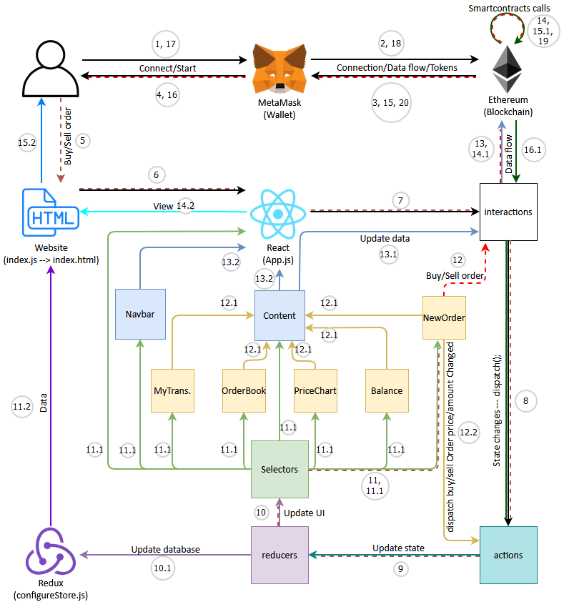

# DEX Token Exchange  
This repository contains project files for a basic decentralized exchange that can run on an Ethereum network. The exchange can trade two tokens - Ether and a unique ERC20 token (DEX Token). 

An example of this project can be found live on the Kovan testnet. Contract addresses can be found below:
* Exchange contract: [0xc7d9FF522F3B531e920795DeE1fc04aa3D0e5210](https://kovan.etherscan.io/address/0xc7d9FF522F3B531e920795DeE1fc04aa3D0e5210)  
* DEX Token contract: [0x6Dfc6c4ec2148C8b7b8fbcE4E65F507efFfef462](https://kovan.etherscan.io/address/0x6Dfc6c4ec2148C8b7b8fbcE4E65F507efFfef462)

This repo includes files for a front-end application to interact with the DEX Token exchange.

An implementation of this project can be found at:  
https://crypto-token-exchange.herokuapp.com/  

## Project Architecture  
This project uses industry standard technology to interact with the Ethereum smart contracts, namely React and Redux.  

### System Design  
  

1. User connect to the MetaMask wallet
2. MetaMask wallet connect to the Ethereum Blockchain
3. Ethereum Blockchain connects to MetaMask
4. MetaMask wallet give User connection to the Blockchain  

--- now User can connect to the DApp ---

5. User/MetaMask send Buy/Sell order to the Website(index.js(index.html))
6. Website send data to the App.js(React/DApp)
7. App.js send data to interactions.js
8. interactions.js send data to the actions.js
9. actions.js send data to the reducers.js
10. reducers.js send data to selectors.js
		10.1. reducers.js send data to configureStore.js(Redux - DApp temporary Data Base)
11. selectors.js send Buy/Sell Order to NewOrder.js
		11.1. selectors.js fill with data UI(User Interface):
    	  * subcomponents - NewOrder.js, Balance.js, PriceChart.js, OrderBook.js, MyTransactions.js.
    	  * main components - Navbar.js, Content.js
    	  * main DApp file - App.js
  	11.2. configureStore.js send data to the Website
12. NewOrder.js send Buy/Sell order to interactions.js
		12.1. UI subcomponents send data to Content.js
		12.2. NewOrder.js send data to actions.js (calculate the New Order cost in the real time)  

		--- after that action.js will go to the step 9 ---

13. interactions.js send Buy/Sell order to the Smart Contracts on Ethereum Blockchain
		13.1. Content send request to interactions.js for updated data from Smart Contracts
		13.2. Navbar and Content send data to App.js
14. Smart Contracts make action to Buy/Sell orders from user
		14.1. interactions.js send request for new data from Smart Contracts
		14.2. App.js send "DApp view" to the Website
15. Smart Contracts ask User for order confirmation via MetaMask
		15.1. Smart Contracts updates data
		15.2. Website send updated "DApp view" to the User
16. MetaMask forwards order confirmation to the User
		16.1 Smart Contracts send updated data to the interaction.js

	--- after that interactions.js will go to the step 8 ---

17. User confirm order via MetaMask
18. MetaMask send confirmation to the Smart Contracts
19. Smart Contracts update the state (make action to the Buy/Sell order)

--- DApp will update this info like in steps 15.1. and 16.1. ---

20. Smart Contracts send Tokens, Ether to the MetaMask/User (or just make order)
